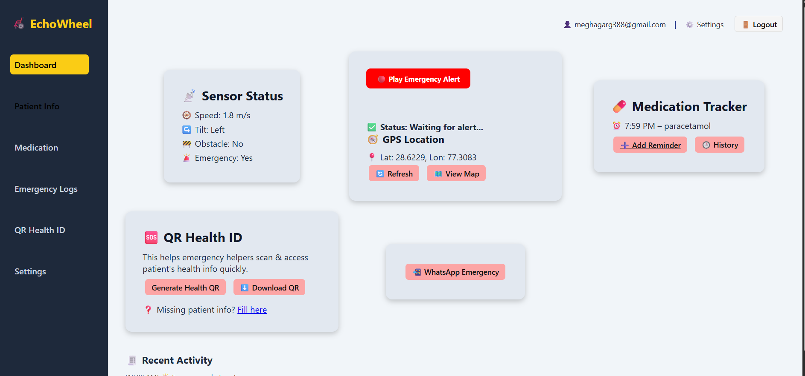
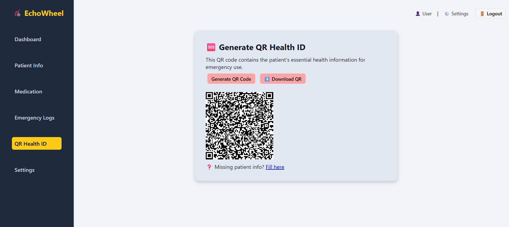

# CodeNest-EchoWheel 

**EchoWheel** is a smart wheelchair emergency assistant web app built for patient safety and medical emergencies.

---
## 📂 Project Pitch Deck

📽️ [View Round 1 PPT Presentation](https://github.com/Megha549/CodeNest-EchoWheel/blob/main/Team_CodeNest.pdf)

## 📌 Features

- 📝 Patient Info Management
- 📍 Real-Time GPS Location Fetch
- 🔊 Emergency Alert Sound + Stop Button
- 🔗 WhatsApp Emergency Contact Integration
- 🆘 QR Code Generation with Patient Health Info
- 🔐 Firebase Auth (Login/Logout)
- ☁️ Firestore Database Integration
---

## 📷 Screenshots

---

## 🚀 How to Run

1. Clone this repo:
git clone https://github.com/Megha549/CodeNest-EchoWheel.git
2. Open in VS Code
3. Run `Live Server` on `dashboard.html`
or 
https://echowheel-9c8ca.web.app 

---

## 🛠 Tech Stack

- HTML, CSS, JavaScript
- Firebase Auth & Firestore
- Google Maps & Geolocation
- WhatsApp Web Link API
- QRCode.js

---

## 🙋‍♀️ Built By
 Megha Garg | [GitHub](https://github.com/Megha549)
 Bhumi Singh | [GitHub](https://github.com/Bhumi187)

---

## ⚠️ Note

> This is a **prototype demo** for hackathon purposes. Some features (like SMS or voice) may be mocked or simplified.
